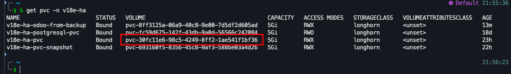
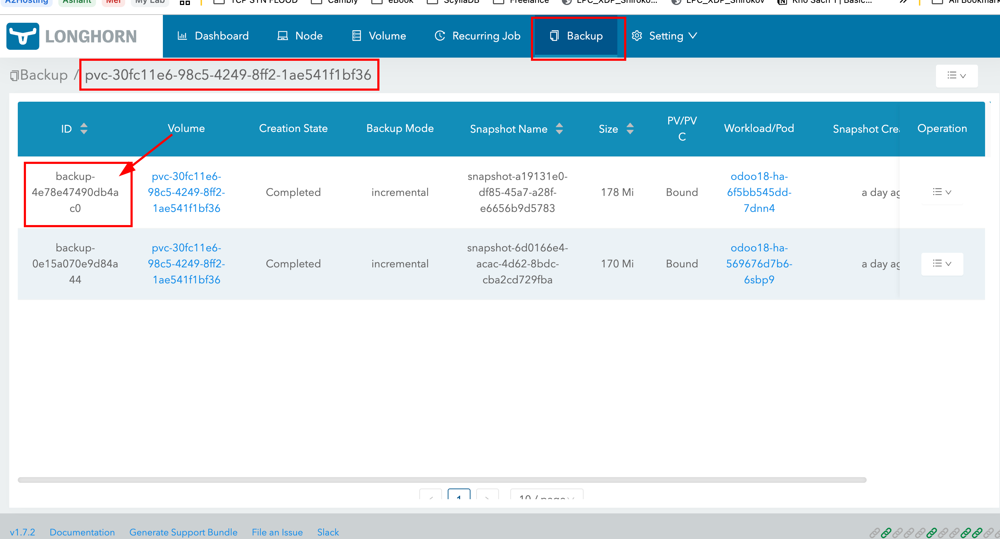

# Volume Backup and Restore Guide

This guide provides step-by-step instructions for backing up and restoring volumes using Longhorn in a Kubernetes cluster. Whether you prefer manual backups or automated cron jobs, this document covers all necessary procedures to ensure your data is safely backed up and can be restored efficiently when needed.

## Table of Contents

1. [Backup Volume](#backup-volume)
   - [Manual Backup](#manual-backup)
   - [Automated Backup with Cron Job](#automated-backup-with-cron-job)
2. [Restore Volume from Backup Manually](#restore-volume-from-backup-manually)
   - [Create Volume from Backup](#1-create-volume-from-backup)
   - [Scale Down Odoo Replicas](#2-scale-down-odoo-replicas-to-0)
   - [Create PV/PVC from Longhorn Volume](#3-create-pvpvc-from-longhorn-volume)
   - [Scale Out the Odoo Deployment](#4-scale-out-the-deployment-odoo)
3. [Restore Volume from Backup with Python script](#restore-volume-from-backup-with-python-script)
   - [Create PVC from Backup](#1-create-pvc-from-backup)
   - [Update Deployment using new PVC created from backup](#2-update-deployment-create-pvc-from-backup)
---

## Backup Volume

Ensuring regular backups of your volumes is crucial for data safety and recovery. You can perform backups manually or set up automated backups using cron jobs.

### Manual Backup

Follow these steps to create a manual backup of your volume:

1. **Create a Backup:**
   - Navigate to the volume details page.
   - Click on **Create Backup**.

   

2. **Check Backup Status:**
   - After initiating the backup, monitor its status to ensure it's completed successfully.

   

### Automated Backup with Cron Job

Automating backups ensures that your data is backed up at regular intervals without manual intervention.

1. **Create a Recurring Backup Job:**
   - Set up a cron job to perform backups at your desired schedule.

   

2. **Change Working Group:**
   - Modify the working group settings as needed to accommodate the backup process.

   

3. **Assign Volume to the Group:**
   - Assign the specific volume to the working group responsible for applying the recurring backup job.

   

---

## Restore Volume from Backup Manually

In the event of data loss or corruption, restoring your volume from a backup ensures minimal downtime and data integrity.

### 1. Create Volume from Backup

Start by creating a new volume using the latest backup.

- **Use the UI to Create Volume:**
  - Navigate to the backup section.
  - Select **Create Volume from Latest Backup**.

  
  

- **Verify the New Volume:**
  - Ensure the new volume has been successfully created.

  

### 2. Scale Down Application's persistent volume to 0

Before restoring, it's essential to scale down the Odoo deployment to prevent conflicts.

- **Edit Deployment YAML:**
  - Open the Odoo deployment YAML file.
  - Set `replicas` to `0`.

- **Apply Changes:**
  ```bash:recipes/backup-and-restore.md
  kubectl apply -f deployment.yaml
  # Or scale down using the command
  kubectl scale deploy -n <namespace_odoo> <odoo_deployment_name> --replicas=0
  ```

### 3. Create PV/PVC from Longhorn Volume

Next, set up the Persistent Volume (PV) and Persistent Volume Claim (PVC) using the restored Longhorn volume.

- **Use UI to Create PV/PVC:**
  - Navigate to the Longhorn UI.
  - Create PV/PVC from the restored volume.

  

- **Verify PVC Creation:**
  - Ensure the PVC is created and bound to the restored Longhorn volume.

  ```bash:recipes/backup-and-restore.md
  kubectl get pvc -n v18e-ha v18e-ha-pvc -o yaml
  ```

  **Output:**
  ```yaml
  apiVersion: v1
  kind: PersistentVolumeClaim
  metadata:
    annotations:
      pv.kubernetes.io/bind-completed: "yes"
    name: v18e-ha-pvc
    namespace: v18e-ha
    ...
  spec:
    accessModes:
      - ReadWriteMany
    resources:
      requests:
        storage: 5Gi
    storageClassName: longhorn
    volumeMode: Filesystem
    volumeName: odoo-ha-restore-from-backup
  status:
    phase: Bound
  ```

### 4. Scale Out the Odoo Deployment

After setting up the restored volume, scale the Odoo deployment back to its original state.

- **Edit Deployment YAML:**
  - Open the Odoo deployment YAML file.
  - Set `replicas` to `2`.

- **Apply Changes:**
  ```bash:recipes/backup-and-restore.md
  kubectl apply -f deployment.yaml
  # Or scale up using the command
  kubectl scale deploy -n <namespace_odoo> <odoo_deployment_name> --replicas=2
  ```

- **Verify Pod Status:**
  - Ensure all Odoo pods are running correctly.

  ```bash:recipes/backup-and-restore.md
  kubectl get pods -n <namespace_odoo>
  ```

  

---

## Summary

By following this guide, you can effectively manage backups and restorations of your Kubernetes volumes using Longhorn. Regular backups, whether manual or automated, ensure data security and facilitate quick recovery in case of unexpected issues.

For any further assistance or advanced configurations, refer to the [Longhorn Documentation](https://longhorn.io/docs/) or contact your system administrator.


## Restore Volume from Backup with Python Script
### 1. Create PVC from backup

- Get the Longhorn `volume name` mapping current PVC



- Get `backup id` information from Longhorn UI `backup` tab



- Exec to python-volume pod located in `longhorn-system namespace`


- Run the python script
```bash
python main.py create-pvc-from-backup \
--namespace <change_me_with_namespace> \
--pvc-name <give_me_a_name> \
--backup-id <id_get_from_previous_step> \
--volume-name <volume_name_from_previous_step>
```

### 2. Update deployment using new PVC created from backup
- Manual apply with CLI
- Edit deployment yaml file
```yaml
apiVersion: apps/v1
kind: Deployment
metadata:
  name: odoo18-ha
  namespace: v18e-ha
  labels:
    app: odoo18-ha
spec:
  replicas: 1
  selector:
    matchLabels:
      app: odoo18-ha
  template:
    metadata:
      labels:
        app: odoo18-ha
    spec:
      volumes:
      - name: odoo-data
        persistentVolumeClaim:
          claimName: <CHANGE_ME_WITH_PVC_NAME_FROM_BACKUP>
      containers:
      - name: odoo
        image: 127.0.0.1:5000/odoo-v18e:commit-5
        envFrom:
        - configMapRef:
            name: odoo-ha-config
    .........
```
- Apply kubectl

```bash
kubectl apply -f deployment.yaml
```

- Edit from k*s management tools: k9s or lens
- Update PVC name 

