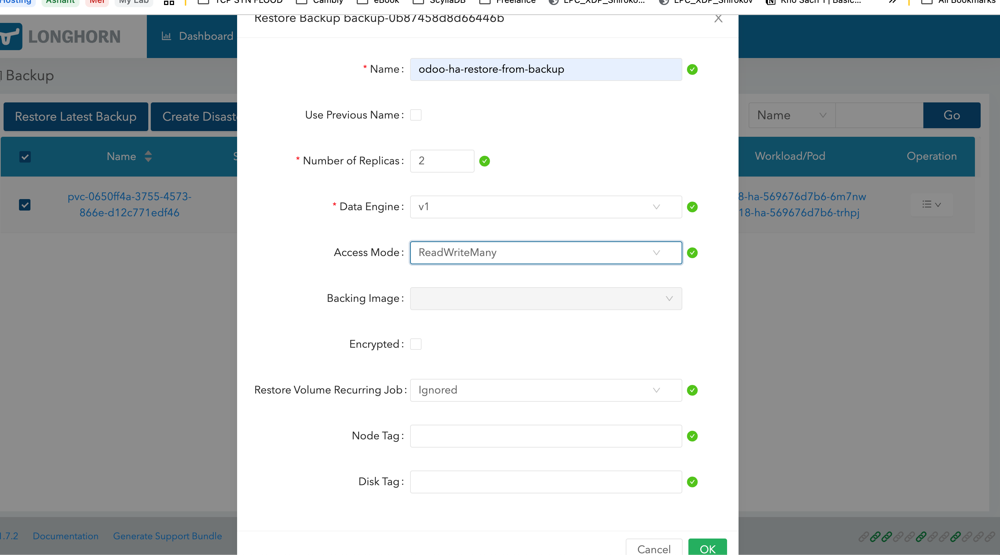

# BACKUP VOLUME
## Manual backup
- Go inside volume detail and create a backup


- Check backup status


## Backup with cron job
- Create recurring backup job


- Change working group


- Assign volume to the group for applying backup recurring job


# RESTORE VOLUME FROM BACKUP
### 1.Create volume from backup

- Use the UI for creating the volume from latest backup





- Check new volume from backup


### 2. Scale down Odoo replicas to 0
- Edit odoo deployment yaml, change repicas to 0 and make update to k0s cluster with kubectl or k8s tools
- Or update using kubectl command

```bash
k apply -f deployment.yaml
## Or scale down by command
kubectl scale deploy -n <namespace_odoo> <odoo_deployment_name> --replicas=0
```

### 3. Create PV/PVC from volume Longhorn
- Use UI for creating PV/PVC from volume Longhorn


- Make sure new pvc is created in k0s cluster and map with new volume Longhorn restore volume

```bash
k get pvc -n v18e-ha  v18e-ha-pvc -oyaml
## OUTPUT
apiVersion: v1
kind: PersistentVolumeClaim
metadata:
  annotations:
    pv.kubernetes.io/bind-completed: "yes"
  creationTimestamp: "2024-12-26T16:08:56Z"
  finalizers:
  - kubernetes.io/pvc-protection
  name: v18e-ha-pvc
  namespace: v18e-ha
  resourceVersion: "11313317"
  uid: a63f35bc-b483-46b6-920f-3138813580fd
spec:
  accessModes:
  - ReadWriteMany
  resources:
    requests:
      storage: 5Gi
  storageClassName: longhorn
  volumeMode: Filesystem
  volumeName: odoo-ha-restore-from-backup (here is the mapping for Longhorn volume)
status:
  accessModes:
  - ReadWriteMany
  capacity:
    storage: 5Gi
  phase: Bound
```

### 4. Scale out the deployment odoo

- Edit odoo deployment yaml, change repicas to 2 and make update to k0s cluster with kubectl or k8s tools
- Or update using kubectl command

```bash
k apply -f deployment.yaml
## Or scale down by command
kubectl scale deploy -n <namespace_odoo> <odoo_deployment_name> --replicas=2
```

- Check the pod status is running
```bash
k get pods -n <namespace_odoo>
```


