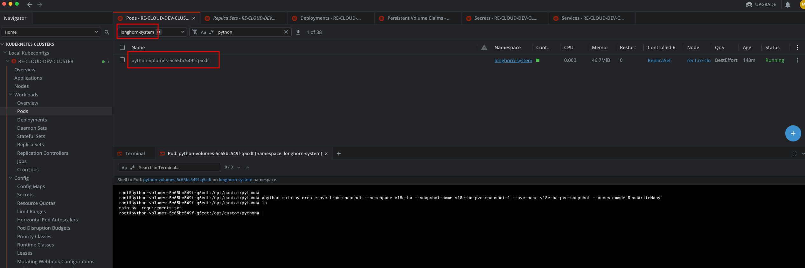
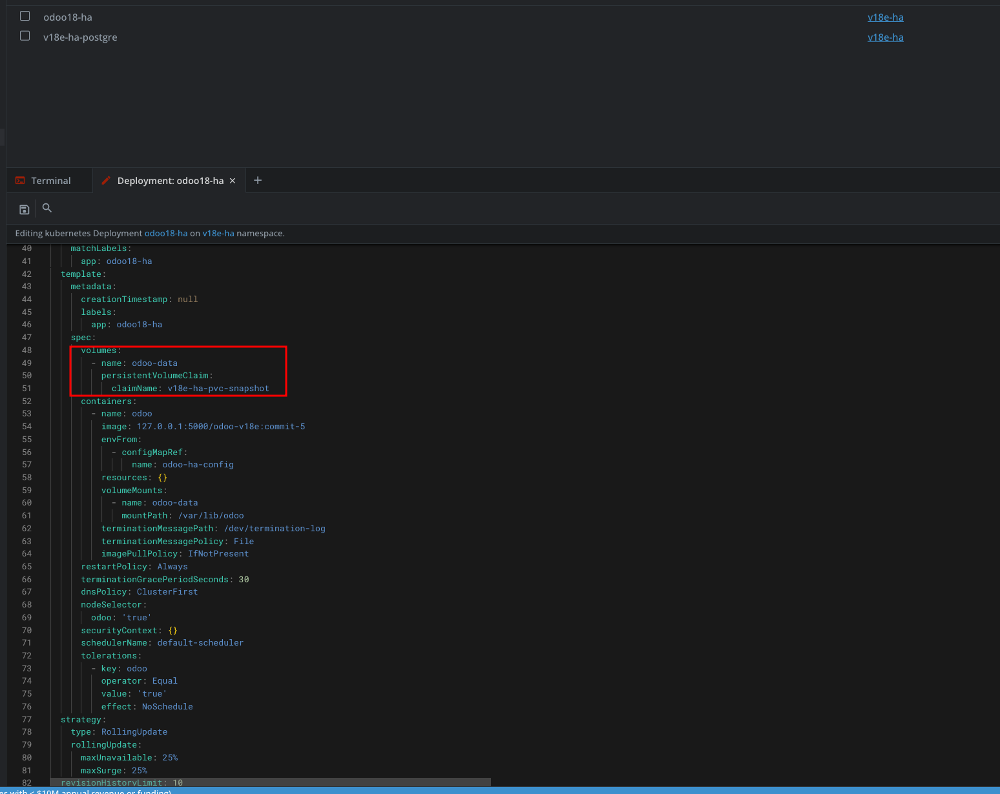

# SNAPSHOT VOLUME WITH LONGHORN AND PYTHON SCRIPT


### 1. Create snapshot with python script
- Exec to python-volume pod located in `longhorn-system namespace`



- Creating a snapshot 

```bash
python main.py create-snapshot \
    --namespace <change_me_with_namespace> \
    --pvc-name <give_me_a_name> \
    --snapshot-name <give_me_a_name>
```

- Listing snapshots for making sure snapshot is present
```bash
# command
 python main.py list-snapshots --namespace <change_me_with_namespace>

# OUTPUT 
Listing VolumeSnapshots in namespace 'v18e-ha':
  - Name: v18e-ha-pvc-snapshot-1
```

## Create a PVC for rolling back from snapshot
- Run command to create a PVC from snapshot
- REMEMBER TO MAKE SURE NEW PVC NAME IS DIFFERENT WITH THE ORIGINAL NAME

```bash
python main.py create-pvc-from-snapshot \
    --namespace <change_me_with_namespace> \
    --snapshot-name <give_me_new_name> \
    --pvc-name <created_snapshot_name> \
    --access-mode ReadWriteMany
```

### 2. Update deployment using new PVC created from snapshot
- Manual apply with CLI
- Edit deployment yaml file
```yaml
apiVersion: apps/v1
kind: Deployment
metadata:
  name: odoo18-ha
  namespace: v18e-ha
  labels:
    app: odoo18-ha
spec:
  replicas: 1
  selector:
    matchLabels:
      app: odoo18-ha
  template:
    metadata:
      labels:
        app: odoo18-ha
    spec:
      volumes:
      - name: odoo-data
        persistentVolumeClaim:
          claimName: <CHANGE_ME_WITH_PVC_NAME_FROM_SNAPSHOT>
      containers:
      - name: odoo
        image: 127.0.0.1:5000/odoo-v18e:commit-5
        envFrom:
        - configMapRef:
            name: odoo-ha-config
    .........
```
- Apply kubectl

```bash
kubectl apply -f deployment.yaml
```

- Edit from k*s management tools: k9s or lens
- Update PVC name 

